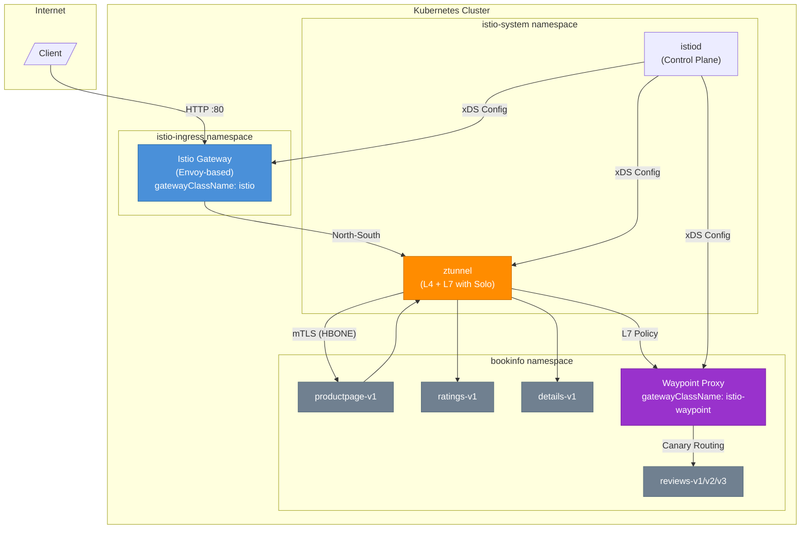

# Ambient Mesh Workshop

## Architecture Overview



### Component Summary

| Component | Purpose |
|-----------|---------|
| **Istio Gateway** | North-South ingress using Kubernetes Gateway API |
| **ztunnel** | Zero-trust L4 mTLS + L7 observability (Solo Enterprise) |
| **Waypoint Proxy** | L7 policy enforcement: canary routing, auth, rate limiting |
| **istiod** | Istio control plane - configuration and certificate management |

---

## Workshop Setup

### Component Versions

| Component | Version |
|-----------|---------|
| Gateway API | v1.4.0 |
| Istio (Solo distribution) | 1.28.1 |
| Gloo Platform | 2.11.0 |

### Step 1: Create Your Environment Configuration

Create an `env.sh` file with your cluster details:

```bash
cat > env.sh << 'EOF'
# Cluster kubectl context (optional if using current context)
export CLUSTER=<your-cluster-context>   # e.g., my-gke-cluster

# Component versions
export ISTIO_VERSION=1.28.1
export GLOO_VERSION=2.11.0

# Solo istioctl path
export ISTIOCTL=/home/$USER/.istioctl/bin/istioctl

# Solo license key (enables Solo Istio distribution + Gloo Platform UI)
export GLOO_MESH_LICENSE_KEY=<your-mesh-key>
EOF
```

Then load the environment:

```bash
source env.sh
```

### Step 2: Verify Prerequisites

Ensure you have the required tools:

```bash
# Check kubectl
kubectl version --client

# Check helm
helm version

# Verify cluster connectivity
kubectl cluster-info
```

### Step 3: Run Setup

Follow the [Setup Guide](setup.md) to install:
- Gateway API CRDs
- Istio Ambient (istiod, CNI, ztunnel)
- Istio Ingress Gateway

After setup, verify all components are running:

```bash
kubectl get pods -n istio-system
```

Expected pods:
- `istiod-*` - Running
- `istio-cni-node-*` (DaemonSet) - Running on each node
- `ztunnel-*` (DaemonSet) - Running on each node

```bash
kubectl get pods -n istio-ingress
```

Expected:
- `istio-ingressgateway-*` - Running

### Step 4: Export Gateway IP

Set the Istio Gateway IP for use during the demo:

```bash
export GATEWAY_IP=$(kubectl get svc -n istio-ingress istio-ingressgateway -o jsonpath="{.status.loadBalancer.ingress[0]['hostname','ip']}")
echo "Gateway IP: $GATEWAY_IP"
```

### Step 5: Access Gloo Platform UI (Optional)

If you set `GLOO_MESH_LICENSE_KEY`, the setup script installs Gloo Platform with the Management UI. This provides:
- **Unified Dashboard** - Visual overview of your mesh, services, and traffic
- **Insights Engine** - Configuration analysis and best practice recommendations
- **Distributed Tracing** - View traces across services via Jaeger
- **Metrics** - Prometheus metrics and Grafana-style visualizations

Verify Gloo Platform is running:

```bash
kubectl get pods -n gloo-mesh
```

Expected pods:
- `gloo-mesh-mgmt-server-*` - Management server
- `gloo-mesh-ui-*` - Web UI
- `gloo-mesh-agent-*` - Local agent
- `gloo-telemetry-*` - Telemetry collection
- `prometheus-*` - Metrics
- `gloo-jaeger-*` - Distributed tracing

Access the UI:

```bash
kubectl port-forward -n gloo-mesh svc/gloo-mesh-ui 8090:8090
```

Open http://localhost:8090 in your browser.

---

# Demo

> **Before starting:** Ensure environment variables are set:
> ```bash
> source env.sh
> export GATEWAY_IP=$(kubectl get svc -n istio-ingress istio-ingressgateway -o jsonpath="{.status.loadBalancer.ingress[0]['hostname','ip']}")
> echo "Gateway IP: $GATEWAY_IP"
> ```

---

## Part 1: Onboarding an Application

### Why This Matters

**The Problem:** Traditional service mesh adoption requires injecting sidecar proxies into every pod. This means:
- Restarting all workloads during onboarding
- 0.5-1 vCPU overhead *per pod* (a "sidecar tax" that adds significant cost at scale)
- Complex upgrades requiring coordinated pod restarts
- Application teams blocked waiting for mesh configuration

**The Solution:** With Ambient Mesh, platform teams enable zero-trust networking for any namespace with a single label - **no sidecars, no restarts, no application changes**. Development teams get security and observability without any friction.

### Step 1: Deploy Bookinfo

We'll use an OTel-instrumented version of Bookinfo that supports distributed tracing. The application components (productpage, details, reviews, ratings) emit their own traces to the OpenTelemetry collector:

```bash
kubectl create ns bookinfo
kubectl apply -n bookinfo -f https://raw.githubusercontent.com/LutzLange/bookinfo/main/platform/kube/bookinfo-otel.yaml
```

> **Note:** This version uses custom images from `ghcr.io/lutzlange/bookinfo-*` with built-in OpenTelemetry instrumentation. The OTLP endpoint is pre-configured to send traces to `gloo-telemetry-collector.gloo-mesh:4317`.

Verify pods are running:

```bash
kubectl get pods -n bookinfo
```

Wait until all pods show `Running` status (1/1 Ready).

### Step 2: Expose via Ingress

Create an HTTPRoute to expose the productpage through the Istio Gateway:

```bash
kubectl apply -f - <<EOF
apiVersion: gateway.networking.k8s.io/v1
kind: HTTPRoute
metadata:
  name: bookinfo
  namespace: bookinfo
spec:
  parentRefs:
  - name: istio-ingressgateway
    namespace: istio-ingress
  rules:
  - matches:
    - path:
        type: Exact
        value: /productpage
    - path:
        type: PathPrefix
        value: /static
    - path:
        type: Exact
        value: /login
    - path:
        type: Exact
        value: /logout
    - path:
        type: PathPrefix
        value: /api/v1/products
    backendRefs:
    - name: productpage
      port: 9080
EOF
```

### Step 3: Verify Application (Not Yet in Mesh)

Test access:

```bash
curl -s http://${GATEWAY_IP}/productpage | grep -o "<title>.*</title>"
```

Expected output:
```
<title>Simple Bookstore App</title>
```

Or open in browser:
```bash
echo "http://${GATEWAY_IP}/productpage"
```

At this point, the application works but **is not in the mesh** - no mTLS, no observability. Traffic between services is unencrypted.

### Step 4: Add to Mesh

Enable ambient mesh for the bookinfo namespace:

```bash
kubectl label namespace bookinfo istio.io/dataplane-mode=ambient
```

**That's it.** Wait a few seconds for ztunnel to pick up the workloads, then the application is part of the mesh with:
- **All traffic encrypted with mTLS** - zero-trust by default
- **Cryptographic identities (SPIFFE)** - no more IP-based security
- **L7 observability** - HTTP metrics without sidecars (Solo Enterprise)
- **No pod restarts** - zero disruption to running workloads

Verify ztunnel is handling traffic:

```bash
kubectl logs -n istio-system -l app=ztunnel --tail=5 | grep bookinfo
```

---

## Part 2: Zero-Trust Security

### Why This Matters

**The Problem:** Organizations struggle to implement zero-trust security across Kubernetes:
- Network policies only work at L3/L4 - they can't verify *who* is making a request
- Traditional firewalls require ticket-based workflows that slow development velocity
- Security teams lack visibility into east-west traffic

**The Solution:** Ambient Mesh provides **automatic mTLS everywhere** - every service gets a cryptographic identity (SPIFFE), and all traffic is encrypted without any per-service configuration.

### Step 5: Verify mTLS

In ambient mode, ztunnel handles all mTLS - workload pods don't have certificate files mounted. Verify traffic is encrypted by checking ztunnel logs:

```bash
# Generate some traffic first
curl -s http://${GATEWAY_IP}/productpage > /dev/null

# Check ztunnel logs for encrypted traffic (HBONE protocol)
kubectl logs -n istio-system -l app=ztunnel --tail=50 | grep -E "inbound|outbound|HBONE"
```

You should see log entries showing traffic being handled by ztunnel with source and destination workload identities.

### Step 6: Add Ingress Gateway to Mesh

Add the ingress gateway namespace to the mesh for end-to-end mTLS:

```bash
kubectl label namespace istio-ingress istio.io/dataplane-mode=ambient
```

Now traffic from client to gateway to application is fully encrypted.

---

## Part 3: Observability

### Why This Matters

Platform teams need visibility into service-to-service communication. Ambient mesh provides metrics and access logs without sidecars.

### Step 7: View Access Logs

Istio access logs show all requests flowing through the mesh:

```bash
# Generate traffic
for i in {1..5}; do curl -s http://${GATEWAY_IP}/productpage > /dev/null; done

# View ztunnel access logs
kubectl logs -n istio-system -l app=ztunnel --tail=20 | grep -E "GET|POST"
```

### Step 8: View Metrics

Check Istio metrics for the bookinfo services:

```bash
# Get metrics from istiod
kubectl exec -n istio-system deploy/istiod -- curl -s localhost:15014/metrics | grep istio_requests_total | head -10
```

For a full observability stack, consider deploying:
- **Prometheus** for metrics collection
- **Grafana** for dashboards
- **Jaeger/Zipkin** for distributed tracing
- **Kiali** for service mesh visualization

---

## Part 4: Traffic Management

### Why This Matters

Waypoint proxies enable advanced L7 traffic management for specific services - canary deployments, header-based routing, and more.

### Step 9: Deploy Waypoint

Waypoints enable L7 traffic management. First, configure the namespace to use a waypoint:

```bash
kubectl label namespace bookinfo istio.io/use-waypoint=waypoint
```

Create the waypoint gateway:

```bash
kubectl apply -f - <<EOF
apiVersion: gateway.networking.k8s.io/v1
kind: Gateway
metadata:
  name: waypoint
  namespace: bookinfo
spec:
  gatewayClassName: istio-waypoint
  listeners:
  - name: mesh
    port: 15008
    protocol: HBONE
EOF
```

Wait for the waypoint to be ready:

```bash
kubectl get gateway waypoint -n bookinfo
```

Create version-specific services for routing (the default bookinfo only has one `reviews` service):

```bash
kubectl apply -f - <<EOF
apiVersion: v1
kind: Service
metadata:
  name: reviews-v1
  namespace: bookinfo
spec:
  selector:
    app: reviews
    version: v1
  ports:
  - port: 9080
    name: http
---
apiVersion: v1
kind: Service
metadata:
  name: reviews-v2
  namespace: bookinfo
spec:
  selector:
    app: reviews
    version: v2
  ports:
  - port: 9080
    name: http
---
apiVersion: v1
kind: Service
metadata:
  name: reviews-v3
  namespace: bookinfo
spec:
  selector:
    app: reviews
    version: v3
  ports:
  - port: 9080
    name: http
EOF
```

### Step 10: Canary Routing

Attach the waypoint to the reviews service:

```bash
kubectl label svc reviews -n bookinfo istio.io/use-waypoint=waypoint
```

Route user "jason" to reviews-v2 (with black stars), everyone else to reviews-v1 (no stars):

```bash
kubectl apply -f - <<EOF
apiVersion: gateway.networking.k8s.io/v1
kind: HTTPRoute
metadata:
  name: reviews
  namespace: bookinfo
spec:
  parentRefs:
  - group: ""
    kind: Service
    name: reviews
    port: 9080
  rules:
  - matches:
    - headers:
      - name: end-user
        value: jason
    backendRefs:
    - name: reviews-v2
      port: 9080
  - backendRefs:
    - name: reviews-v1
      port: 9080
EOF
```

Wait ~10 seconds for routing rules to propagate.

**Test Canary Routing:**

1. Open `http://${GATEWAY_IP}/productpage`
2. **Without login:** No stars (reviews-v1)
3. **Login as "jason":** Black stars (reviews-v2)
4. **Login as anyone else:** No stars (reviews-v1)

Or test via CLI:

```bash
# Default - reviews-v1 (no stars)
kubectl exec -n bookinfo deploy/ratings-v1 -- curl -s reviews:9080/reviews/0 | grep -o '"color"[^,]*' || echo "No color (v1)"

# User jason - reviews-v2 (black stars)
kubectl exec -n bookinfo deploy/ratings-v1 -- curl -s -H "end-user: jason" reviews:9080/reviews/0 | grep -o '"color"[^,]*'
```

### Step 11: Traffic Shifting

Gradually shift traffic from reviews-v1 to reviews-v3 (red stars):

```bash
kubectl apply -f - <<EOF
apiVersion: gateway.networking.k8s.io/v1
kind: HTTPRoute
metadata:
  name: reviews
  namespace: bookinfo
spec:
  parentRefs:
  - group: ""
    kind: Service
    name: reviews
    port: 9080
  rules:
  - backendRefs:
    - name: reviews-v1
      port: 9080
      weight: 80
    - name: reviews-v3
      port: 9080
      weight: 20
EOF
```

Now 20% of traffic goes to reviews-v3. Refresh the page multiple times to see the shift.

---

## Summary

| Capability | How | Benefit |
|------------|-----|---------|
| **Onboard to Mesh** | One namespace label | Zero disruption, no sidecars |
| **mTLS Everywhere** | Automatic with ambient | Zero-trust security by default |
| **Observability** | ztunnel L7 telemetry | Visibility without overhead |
| **Canary Routing** | HTTPRoute + Waypoint | Safe deployments with L7 control |

### Key Takeaways

1. **No Sidecars Required:** Ambient mesh provides security and observability without sidecar injection
2. **Kubernetes-Native:** Uses standard Gateway API resources
3. **Progressive Adoption:** Start with namespace labels, add waypoints only where L7 control is needed
4. **Zero Disruption:** Onboard existing workloads without restarts

---

# Optional: Distributed Tracing

> This section configures end-to-end distributed tracing across all mesh components. **Requires Gloo Platform** with Jaeger (installed by setup.sh when `GLOO_MESH_LICENSE_KEY` is set).

## Prerequisites

Verify Gloo Platform is installed:

```bash
kubectl get pods -n gloo-mesh | grep jaeger
```

Expected: `gloo-jaeger-*` pod running.

## Step 12: Configure Tracing

### Step 12.1: Configure ztunnel Tracing

Solo's Enterprise ztunnel includes L7 tracing capabilities. Update the config to point to the Gloo telemetry collector:

```bash
kubectl patch configmap istio-ztunnel -n istio-system --type merge -p '{
  "data": {
    "l7_config.yaml": "accessLog:\n  enabled: true\n  skipConnectionLog: false\ndistributedTracing:\n  enabled: true\n  otlpEndpoint: http://gloo-telemetry-collector.gloo-mesh:4317\nenabled: true\nmetrics:\n  enabled: true\n"
  }
}'
```

### Step 12.2: Create ClusterIP Service for Telemetry Collector

The default telemetry collector service is headless, which doesn't work with waypoint proxies. Create a ClusterIP service:

```bash
kubectl apply -f - <<EOF
apiVersion: v1
kind: Service
metadata:
  name: gloo-telemetry-collector-clusterip
  namespace: gloo-mesh
spec:
  type: ClusterIP
  selector:
    app.kubernetes.io/instance: gloo-platform
    app.kubernetes.io/name: telemetryCollector
    component: agent-collector
  ports:
  - name: grpc-otlp
    port: 4317
    targetPort: 4317
    appProtocol: grpc
  - name: otlp-http
    port: 4318
    targetPort: 4318
EOF
```

### Step 12.3: Add Extension Provider to Mesh Config

Add an OpenTelemetry extension provider to the Istio mesh config:

```bash
# Get current mesh config
CURRENT_MESH=$(kubectl get configmap istio -n istio-system -o jsonpath='{.data.mesh}')

# Check if already configured
if echo "$CURRENT_MESH" | grep -q "gloo-telemetry-collector-clusterip"; then
    echo "Already configured"
else
    # Add extension provider
    NEW_MESH="${CURRENT_MESH}
extensionProviders:
- name: otel-tracing
  opentelemetry:
    service: gloo-telemetry-collector-clusterip.gloo-mesh.svc.cluster.local
    port: 4317"

    kubectl patch configmap istio -n istio-system \
        --type merge -p "{\"data\":{\"mesh\":$(echo "$NEW_MESH" | jq -Rs .)}}"

    # Restart istiod
    kubectl rollout restart deployment/istiod -n istio-system
    kubectl rollout status deployment/istiod -n istio-system --timeout=120s
fi
```

### Step 12.4: Create Telemetry Resources

Create Telemetry resources for mesh, gateway (trace initiator), and waypoint:

```bash
# Mesh-wide tracing (enables ztunnel traces)
kubectl apply -f - <<EOF
apiVersion: telemetry.istio.io/v1
kind: Telemetry
metadata:
  name: mesh-tracing
  namespace: istio-system
spec:
  tracing:
  - providers:
    - name: otel-tracing
    randomSamplingPercentage: 100
EOF

# Istio Gateway tracing (TRACE INITIATOR - uses targetRefs to target Gateway resource)
kubectl apply -f - <<EOF
apiVersion: telemetry.istio.io/v1
kind: Telemetry
metadata:
  name: tracing-gateway
  namespace: istio-ingress
spec:
  targetRefs:
  - kind: Gateway
    name: istio-ingressgateway
    group: gateway.networking.k8s.io
  tracing:
  - providers:
    - name: otel-tracing
    randomSamplingPercentage: 100
EOF

# Waypoint tracing (enables L7 traces through waypoint)
kubectl apply -f - <<EOF
apiVersion: telemetry.istio.io/v1
kind: Telemetry
metadata:
  name: tracing-waypoint
  namespace: bookinfo
spec:
  targetRefs:
  - kind: Gateway
    name: waypoint
    group: gateway.networking.k8s.io
  tracing:
  - providers:
    - name: otel-tracing
    randomSamplingPercentage: 100
EOF
```

> **Key Insight:** The Istio Gateway is the **trace initiator**. It uses `targetRefs` with `kind: Gateway` and `group: gateway.networking.k8s.io` to target the Gateway resource. This configures `spawnUpstreamSpan: true` which starts new traces for incoming requests.

### Step 12.5: Apply Changes

Restart Istio Gateway (trace initiator), ztunnel, and waypoint to apply the tracing configuration:

```bash
# Restart Istio Gateway to enable trace initiation
kubectl rollout restart deploy -n istio-ingress
kubectl rollout status deploy/istio-ingressgateway-istio -n istio-ingress --timeout=120s

# Restart ztunnel and waypoint
kubectl rollout restart daemonset/ztunnel -n istio-system
kubectl rollout restart deployment/waypoint -n bookinfo
kubectl rollout status daemonset/ztunnel -n istio-system --timeout=120s
```

### Step 12.6: Generate Traffic and View Traces

Generate traffic:

```bash
for i in {1..10}; do
    curl -s http://${GATEWAY_IP}/productpage > /dev/null
    sleep 1
done
```

Access Jaeger via the Gloo Platform UI:

```bash
kubectl port-forward -n gloo-mesh svc/gloo-mesh-ui 8090:8090
```

Open http://localhost:8090 and navigate to **Tracing** in the sidebar:

1. Select service `productpage.bookinfo` or `waypoint.bookinfo`
2. Click **Find Traces**
3. Click on a trace to see the full request flow

### Expected Trace Flow

```
Client → Istio Gateway (trace start) → ztunnel → waypoint → productpage → reviews/details/ratings
```

Services visible in traces:
- `istio-ingressgateway-istio.istio-ingress` - **Trace initiator** (Istio Gateway)
- `ztunnel` - L4/L7 mesh proxy (Solo Enterprise feature)
- `waypoint.bookinfo` - L7 waypoint proxy traces
- `productpage`, `details`, `ratings` - Application services

> **Note:** The Istio Gateway initiates traces because it has `spawnUpstreamSpan: true` configured via the Telemetry API with `targetRefs`. Without this configuration, no traces would be generated.

---

# Optional: Enterprise Features with Gloo Gateway

> This section covers Gloo Gateway v2, Solo.io's enterprise API gateway. It provides additional features like rate limiting, external auth, and advanced traffic policies.

## Prerequisites

You'll need:
- Gloo Gateway license key
- Solo.io Helm repository access

Set the license key:

```bash
export GLOO_GATEWAY_LICENSE_KEY=<your-license-key>
```

## Install Gloo Gateway

### Install CRDs

```bash
helm upgrade -i --create-namespace --namespace gloo-system \
  --version 2.0.1 \
  gloo-gateway-crds oci://us-docker.pkg.dev/solo-public/gloo-gateway/charts/gloo-gateway-crds
```

### Install Gloo Gateway

```bash
helm upgrade -i -n gloo-system gloo-gateway \
  oci://us-docker.pkg.dev/solo-public/gloo-gateway/charts/gloo-gateway \
  --version 2.0.1 \
  --set licensing.glooGatewayLicenseKey=$GLOO_GATEWAY_LICENSE_KEY
```

### Wait for Deployment

```bash
kubectl rollout status deployment/gloo-gateway -n gloo-system --timeout=120s
```

## Create Gloo Gateway Ingress

Create a Gateway using Gloo Gateway:

```bash
kubectl apply -f - <<EOF
kind: Gateway
apiVersion: gateway.networking.k8s.io/v1
metadata:
  name: gloo-gateway
  namespace: gloo-system
spec:
  gatewayClassName: gloo-gateway-v2
  listeners:
  - protocol: HTTP
    port: 80
    name: http
    allowedRoutes:
      namespaces:
        from: All
EOF
```

Get the Gloo Gateway IP:

```bash
export GLOO_IP=$(kubectl get svc -n gloo-system gloo-gateway -o jsonpath="{.status.loadBalancer.ingress[0]['hostname','ip']}")
echo "Gloo Gateway IP: $GLOO_IP"
```

## Expose Bookinfo via Gloo Gateway

Create a Static Backend to route through the Service VIP (required for waypoint integration):

```bash
kubectl apply -f - <<EOF
apiVersion: gateway.kgateway.dev/v1alpha1
kind: Backend
metadata:
  name: productpage-vip
  namespace: bookinfo
spec:
  type: Static
  static:
    hosts:
    - host: productpage.bookinfo.svc.cluster.local
      port: 9080
EOF
```

Create the HTTPRoute:

```bash
kubectl apply -f - <<EOF
apiVersion: gateway.networking.k8s.io/v1
kind: HTTPRoute
metadata:
  name: bookinfo-gloo
  namespace: bookinfo
spec:
  parentRefs:
  - name: gloo-gateway
    namespace: gloo-system
  rules:
  - matches:
    - path:
        type: Exact
        value: /productpage
    - path:
        type: PathPrefix
        value: /static
    - path:
        type: Exact
        value: /login
    - path:
        type: Exact
        value: /logout
    backendRefs:
    - name: productpage-vip
      kind: Backend
      group: gateway.kgateway.dev
EOF
```

Test access:

```bash
curl -s http://${GLOO_IP}/productpage | grep -o "<title>.*</title>"
```

## Rate Limiting

Apply a rate limit to productpage (5 requests/minute):

```bash
kubectl apply -f - <<EOF
apiVersion: gloo.solo.io/v1alpha1
kind: GlooTrafficPolicy
metadata:
  name: productpage-ratelimit
  namespace: bookinfo
spec:
  targetRefs:
  - group: gateway.networking.k8s.io
    kind: HTTPRoute
    name: bookinfo-gloo
  rateLimit:
    local:
      tokenBucket:
        maxTokens: 5
        tokensPerFill: 5
        fillInterval: 60s
EOF
```

**Test Rate Limiting:**

```bash
for i in {1..10}; do
  echo "Request $i: $(curl -s -o /dev/null -w "%{http_code}" http://${GLOO_IP}/productpage)"
  sleep 0.5
done
```

Expected: First 5 return `200`, remaining return `429 Too Many Requests`.

**Clean Up Rate Limit:**

```bash
kubectl delete glootrafficpolicy productpage-ratelimit -n bookinfo
```

## Add Gloo Gateway to Mesh

For end-to-end mTLS through Gloo Gateway:

```bash
kubectl label namespace gloo-system istio.io/dataplane-mode=ambient
```

---

## Cleanup

Remove Bookinfo application:

```bash
kubectl delete ns bookinfo
```

Remove Istio Gateway:

```bash
kubectl delete ns istio-ingress
```

Remove Gloo Platform (if installed):

```bash
helm uninstall gloo-platform -n gloo-mesh
helm uninstall gloo-platform-crds -n gloo-mesh
kubectl delete ns gloo-mesh
```

Remove Istio (if no longer needed):

```bash
helm uninstall ztunnel -n istio-system
helm uninstall istio-cni -n istio-system
helm uninstall istiod -n istio-system
helm uninstall istio-base -n istio-system
kubectl delete ns istio-system
```

Remove Gloo Gateway (if installed):

```bash
kubectl delete gateway gloo-gateway -n gloo-system
helm uninstall gloo-gateway -n gloo-system
helm uninstall gloo-gateway-crds -n gloo-system
kubectl delete ns gloo-system
```
