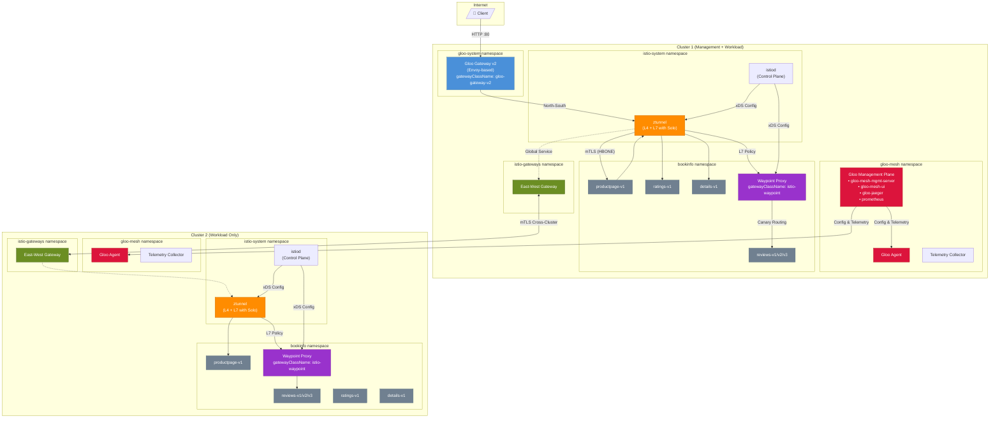

# Omni

## Architecture Overview



### Component Summary

| Component | Location | Purpose |
|-----------|----------|---------|
| **Gloo Gateway v2** | cluster1: gloo-system | North-South ingress, API Gateway (Envoy-based, not Istio) |
| **Gloo Management Plane** | cluster1: gloo-mesh | Unified UI, Insights, Telemetry, Jaeger |
| **Gloo Agent** | both clusters: gloo-mesh | Connects workload clusters to management plane |
| **istiod** | both clusters: istio-system | Istio control plane, manages ztunnel & waypoint config |
| **ztunnel** | both clusters: istio-system (DaemonSet) | L4 mTLS, L7 observability (Solo Enterprise) |
| **East-West Gateway** | both clusters: istio-gateways | Cross-cluster traffic routing |
| **Waypoint Proxy** | both clusters: bookinfo | L7 policy enforcement (canary, auth, rate limiting) |
| **Bookinfo Services** | both clusters: bookinfo | productpage, reviews (v1/v2/v3), ratings, details |

### Traffic Flows

1. **North-South (Ingress)**: Client → Gloo Gateway → ztunnel → productpage
2. **East-West (Service-to-Service)**: productpage → ztunnel → [waypoint] → reviews → ratings
3. **Cross-Cluster**: ztunnel → East-West Gateway → East-West Gateway → ztunnel → service
4. **L7 Policy Path**: ztunnel → Waypoint Proxy → target service (only for labeled services)

---


Gloo: An omni-directional solution that covers ingress, service-to-service, and egress traffic with a unified approach.

## What's New in This Guide

This guide has been updated to reflect the current versions of Solo.io products:

| Component | Version |
|-----------|---------|
| Gateway API | v1.4.0 |
| Gloo Gateway | 2.0.1 |
| Gloo Operator | 0.4.2 |
| Istio (Solo distribution) | 1.28.0 |
| Gloo Platform | 2.11.0 |

**Key Changes:**
- Gloo Gateway v2 is now based on the CNCF kgateway project and uses Kubernetes Gateway API natively
- gatewayClassName changed from `gloo-gateway` to `gloo-gateway-v2`
- Gloo Operator now installs to `gloo-mesh` namespace (previously `gloo-system`)
- ServiceMeshController now requires `dataplaneMode` and `installNamespace` fields
- Waypoint: Use `istio-waypoint` class for ambient mesh L7 policies

### Env

1. Create two clusters
2. Download the latest Solo istioctl build

Set env vars
```bash
export CLUSTER1=gke_ambient_one
export CLUSTER2=gke_ambient_two
export ISTIO_VERSION=1.28.0
```

Download istioctl:
```bash
curl -L https://istio.io/downloadIstio | ISTIO_VERSION=${ISTIO_VERSION} sh -
cd istio-${ISTIO_VERSION}
export PATH=$PWD/bin:$PATH
export ISTIOCTL=$(which istioctl)
```

## Deploy Bookinfo sample

```bash
for context in ${CLUSTER1} ${CLUSTER2}; do
  kubectl --context ${context} create ns bookinfo 
  kubectl --context ${context} apply -n bookinfo -f https://raw.githubusercontent.com/istio/istio/release-1.24/samples/bookinfo/platform/kube/bookinfo.yaml
  kubectl --context ${context} apply -n bookinfo -f https://raw.githubusercontent.com/istio/istio/release-1.24/samples/bookinfo/platform/kube/bookinfo-versions.yaml
done
```

## Install Gloo Gateway v2 on cluster1

Gloo Gateway v2 is built on the CNCF kgateway project and implements the Kubernetes Gateway API natively. It provides enterprise features including external auth and rate limiting.

### Install Gateway API CRDs

```bash
kubectl --context ${CLUSTER1} apply -f https://github.com/kubernetes-sigs/gateway-api/releases/download/v1.4.0/standard-install.yaml
```

### Install Gloo Gateway CRDs

```bash
helm upgrade -i --create-namespace --namespace gloo-system \
  --kube-context ${CLUSTER1} \
  --version 2.0.1 \
  gloo-gateway-crds oci://us-docker.pkg.dev/solo-public/gloo-gateway/charts/gloo-gateway-crds
```

### Install Gloo Gateway

```bash
helm upgrade -i -n gloo-system gloo-gateway \
  oci://us-docker.pkg.dev/solo-public/gloo-gateway/charts/gloo-gateway \
  --kube-context ${CLUSTER1} \
  --version 2.0.1 \
  --set licensing.glooGatewayLicenseKey=$GLOO_GATEWAY_LICENSE_KEY
```

Check that all pods are up:
```bash
kubectl --context ${CLUSTER1} get pods -n gloo-system
```

Verify the GatewayClass is available:
```bash
kubectl --context ${CLUSTER1} get gatewayclasses
```

Expected output:
```
NAME              CONTROLLER                ACCEPTED   AGE
gloo-gateway-v2   solo.io/gloo-gateway-v2   True       35s
```

## Gloo Gateway to expose productpage

> **Note:** The gatewayClassName is now `gloo-gateway-v2` (previously `gloo-gateway`)

```yaml
kubectl --context=${CLUSTER1} apply -f - <<EOF
kind: Gateway
apiVersion: gateway.networking.k8s.io/v1
metadata:
  name: http
  namespace: gloo-system
spec:
  gatewayClassName: gloo-gateway-v2
  listeners:
  - protocol: HTTP
    port: 80
    name: http
    allowedRoutes:
      namespaces:
        from: All
---
apiVersion: gateway.networking.k8s.io/v1
kind: HTTPRoute
metadata:
  name: bookinfo-gg
  namespace: bookinfo
spec:
  parentRefs:
  - name: http
    namespace: gloo-system
  rules:
  - matches:
    - path:
        type: Exact
        value: /productpage
    - path:
        type: PathPrefix
        value: /static
    - path:
        type: Exact
        value: /login
    - path:
        type: Exact
        value: /logout
    backendRefs:
    - name: productpage
      port: 9080
EOF
```

Get the IP address of Gloo Gateway and hit productpage. This should route you to productpage on cluster1:

> **Note:** In Gloo Gateway v2, the proxy service is named after the Gateway resource (in this case `http`)

```bash
export GLOO_IP=$(kubectl get svc -n gloo-system http --context $CLUSTER1 -o jsonpath="{.status.loadBalancer.ingress[0]['hostname','ip']}") && echo $GLOO_IP
open http://${GLOO_IP}/productpage
```


# Install Istio

## Configure Trust

> **Note:** Adjust the certificate paths based on your directory structure

```bash
for context in ${CLUSTER1} ${CLUSTER2}; do
  kubectl --context=${context} create ns istio-system || true
  kubectl --context=${context} create ns istio-gateways || true
done

kubectl --context=${CLUSTER1} create secret generic cacerts -n istio-system \
  --from-file=./omni/certs/cluster1/ca-cert.pem \
  --from-file=./omni/certs/cluster1/ca-key.pem \
  --from-file=./omni/certs/cluster1/root-cert.pem \
  --from-file=./omni/certs/cluster1/cert-chain.pem

kubectl --context=${CLUSTER2} create secret generic cacerts -n istio-system \
  --from-file=./omni/certs/cluster2/ca-cert.pem \
  --from-file=./omni/certs/cluster2/ca-key.pem \
  --from-file=./omni/certs/cluster2/root-cert.pem \
  --from-file=./omni/certs/cluster2/cert-chain.pem
```

## Install Istio using the Gloo Operator

The Gloo Operator simplifies Istio lifecycle management. It uses a `ServiceMeshController` custom resource to declaratively install and manage Istio components.

> **Note:** The operator now installs to `gloo-mesh` namespace (previously `gloo-system`)

```bash
for context in ${CLUSTER1} ${CLUSTER2}; do
  helm upgrade --install --kube-context=${context} gloo-operator \
    oci://us-docker.pkg.dev/solo-public/gloo-operator-helm/gloo-operator \
    --version 0.4.2 \
    -n gloo-mesh \
    --create-namespace \
    --set manager.env.SOLO_ISTIO_LICENSE_KEY=${GLOO_MESH_LICENSE_KEY} &
done
wait
```

Verify the operator pods are running:
```bash
for context in ${CLUSTER1} ${CLUSTER2}; do
  kubectl --context=${context} get pods -n gloo-mesh -l app.kubernetes.io/name=gloo-operator
done
```

Use the `ServiceMeshController` resource to install Istio on both clusters.

> **Note:** The ServiceMeshController now requires:
> - `dataplaneMode: Ambient` (or `Sidecar` for sidecar mode)
> - `installNamespace: istio-system`
> - Resource is applied to `gloo-mesh` namespace
> - Name is `managed-istio` (not `istio`)

```bash
kubectl --context=${CLUSTER1} apply -n gloo-mesh -f - <<EOF
apiVersion: operator.gloo.solo.io/v1
kind: ServiceMeshController
metadata:
  name: managed-istio
  labels:
    app.kubernetes.io/name: managed-istio
spec:
  cluster: cluster1
  network: cluster1
  dataplaneMode: Ambient
  installNamespace: istio-system
  version: ${ISTIO_VERSION}
  meshConfig:
    enableTracing: true
    defaultConfig:
      tracing: {}
    extensionProviders:
    - name: jaeger-tracing
      zipkin:
        service: gloo-jaeger-collector.gloo-mesh.svc.cluster.local
        port: 9411
EOF

kubectl --context=${CLUSTER2} apply -n gloo-mesh -f - <<EOF
apiVersion: operator.gloo.solo.io/v1
kind: ServiceMeshController
metadata:
  name: managed-istio
  labels:
    app.kubernetes.io/name: managed-istio
spec:
  cluster: cluster2
  network: cluster2
  dataplaneMode: Ambient
  installNamespace: istio-system
  version: ${ISTIO_VERSION}
  meshConfig:
    enableTracing: true
    defaultConfig:
      tracing: {}
    extensionProviders:
    - name: jaeger-tracing
      zipkin:
        service: gloo-telemetry-collector.gloo-mesh.svc.cluster.local
        port: 9411
EOF
```

> **Note:** 
> - On cluster1: Traces go directly to `gloo-jaeger-collector` (Jaeger is installed here)
> - On cluster2: Traces go to `gloo-telemetry-collector` which forwards them to the telemetry gateway on cluster1

Verify the ServiceMeshController status:
```bash
kubectl --context=${CLUSTER1} describe servicemeshcontroller -n gloo-mesh managed-istio
kubectl --context=${CLUSTER2} describe servicemeshcontroller -n gloo-mesh managed-istio
```

Wait for `Phase: SUCCEEDED` in the status output.

Verify Istio components are running:
```bash
for context in ${CLUSTER1} ${CLUSTER2}; do
  echo "=== $context ==="
  kubectl --context=${context} get pods -n istio-system
done
```

Expected pods: `istiod-gloo-*`, `istio-cni-node-*`, `ztunnel-*`

Verify the GatewayClasses after Istio installation:
```bash
kubectl --context ${CLUSTER1} get gatewayclasses
```

Expected output (Istio adds its own GatewayClasses):
```
NAME              CONTROLLER                     ACCEPTED   AGE
gloo-gateway-v2   solo.io/gloo-gateway-v2        True       10m
istio             istio.io/gateway-controller    True       1m
istio-eastwest    istio.io/eastwest-controller   True       1m
istio-remote      istio.io/unmanaged-gateway     True       1m
istio-waypoint    istio.io/mesh-controller       True       1m
```

> **Note:** The `istio-waypoint` class provides L7 policy enforcement for ambient mesh workloads.

## Gloo Management Plane

The Gloo Management Plane provides a unified UI and observability for your service mesh and gateway deployments. Install it now so the UI is available to observe the mesh as you onboard services.

It includes:
- **Gloo UI**: Dashboard for configuration, health, and compliance status
- **Insights Engine**: Automatic analysis for security and resiliency issues
- **Telemetry Collection**: OpenTelemetry-based metrics and traces

### Install meshctl CLI

```bash
curl -sL https://run.solo.io/meshctl/install | GLOO_MESH_VERSION=v2.11.0 sh -
export PATH=$HOME/.gloo-mesh/bin:$PATH
meshctl version
```

### cluster1 will be both workload and management:

```bash
export GLOO_VERSION=2.11.0

helm repo add gloo-platform https://storage.googleapis.com/gloo-platform/helm-charts
helm repo update
```

> **Note:** If Gloo Gateway is already installed, some CRDs may conflict. Adopt them first:

```bash
kubectl --context ${CLUSTER1} annotate crd authconfigs.extauth.solo.io \
  meta.helm.sh/release-name=gloo-platform-crds \
  meta.helm.sh/release-namespace=gloo-mesh \
  --overwrite
```

```bash
helm upgrade -i gloo-platform-crds gloo-platform/gloo-platform-crds \
  -n gloo-mesh \
  --kube-context ${CLUSTER1} \
  --create-namespace \
  --version ${GLOO_VERSION}

helm upgrade -i gloo-platform gloo-platform/gloo-platform \
  -n gloo-mesh \
  --kube-context ${CLUSTER1} \
  --version ${GLOO_VERSION} \
  --set common.cluster=cluster1 \
  --set licensing.glooMeshLicenseKey=$GLOO_MESH_LICENSE_KEY \
  --set glooMgmtServer.enabled=true \
  --set glooUi.enabled=true \
  --set glooInsightsEngine.enabled=true \
  --set glooAgent.enabled=true \
  --set prometheus.enabled=true \
  --set telemetryGateway.enabled=true \
  --set telemetryCollector.enabled=true \
  --set jaeger.enabled=true \
  --set 'telemetryGatewayCustomization.pipelines.traces/jaeger.enabled=true' \
  --set 'telemetryCollectorCustomization.pipelines.traces/istio.enabled=true'
```

Verify the management plane pods are running:

```bash
kubectl --context ${CLUSTER1} get pods -n gloo-mesh
```

Wait for all pods to be `Running` before proceeding. You should see `gloo-mesh-mgmt-server`, `gloo-mesh-ui`, `prometheus`, `gloo-telemetry-gateway`, `gloo-telemetry-collector`, and `gloo-jaeger` pods.

### Register clusters as workload clusters

Get the telemetry gateway address:

```bash
export TELEMETRY_GATEWAY_ADDRESS=$(kubectl get svc -n gloo-mesh gloo-telemetry-gateway --context $CLUSTER1 -o jsonpath="{.status.loadBalancer.ingress[0]['hostname','ip']}"):4317 && echo $TELEMETRY_GATEWAY_ADDRESS
```

Register cluster1 (management + workload):

```bash
meshctl cluster register cluster1 \
  --kubecontext $CLUSTER1 \
  --profiles gloo-mesh-agent \
  --remote-context $CLUSTER1 \
  --telemetry-server-address $TELEMETRY_GATEWAY_ADDRESS
```

Register cluster2 (workload only):

```bash
meshctl cluster register cluster2 \
  --kubecontext $CLUSTER1 \
  --profiles gloo-mesh-agent \
  --remote-context $CLUSTER2 \
  --telemetry-server-address $TELEMETRY_GATEWAY_ADDRESS
```

### Access the Gloo UI

```bash
kubectl --context ${CLUSTER1} port-forward -n gloo-mesh svc/gloo-mesh-ui 8090:8090
```

Open http://localhost:8090 in your browser. You should see both clusters registered.


> **Note:** The Jaeger tracing UI is available under the "Tracing" menu. However, in Ambient Mesh, traces are only generated by L7 proxies (gateways and waypoints). You will see traces after deploying waypoint proxies and configuring Telemetry resources later in this guide.

## Onboard Gloo Gateway and Bookinfo to the Mesh

```bash
kubectl --context ${CLUSTER1} label namespace gloo-system istio.io/dataplane-mode=ambient
kubectl --context ${CLUSTER1} label namespace bookinfo istio.io/dataplane-mode=ambient
kubectl --context ${CLUSTER2} label namespace bookinfo istio.io/dataplane-mode=ambient
```

### Peer the clusters together

Deploy an east-west gateway:
```bash
$ISTIOCTL --context=${CLUSTER1} multicluster expose -n istio-gateways
$ISTIOCTL --context=${CLUSTER2} multicluster expose -n istio-gateways
```

Wait for LoadBalancer IPs to be assigned:
```bash
kubectl --context ${CLUSTER1} get svc -n istio-gateways -w
kubectl --context ${CLUSTER2} get svc -n istio-gateways -w
```

Link clusters together (run after External-IPs are assigned):
```bash
$ISTIOCTL multicluster link --contexts=$CLUSTER1,$CLUSTER2 -n istio-gateways
```

## Multi-Cluster Services

Enable productpage to be multi-cluster on both clusters:
```bash
for context in ${CLUSTER1} ${CLUSTER2}; do
  kubectl --context ${context} -n bookinfo label service productpage solo.io/service-scope=global
  kubectl --context ${context} -n bookinfo annotate service productpage networking.istio.io/traffic-distribution=Any
done
```

## Gloo Gateway Multi-Cluster Routing

Update the previously applied HTTPRoute to route to the global productpage destination:
```yaml
kubectl --context=${CLUSTER1} apply -f - <<EOF
apiVersion: gateway.networking.k8s.io/v1
kind: HTTPRoute
metadata:
  name: bookinfo-gg
  namespace: bookinfo
spec:
  parentRefs:
  - name: http
    namespace: gloo-system
  rules:
  - matches:
    - path:
        type: Exact
        value: /productpage
    - path:
        type: PathPrefix
        value: /static
    - path:
        type: Exact
        value: /login
    - path:
        type: Exact
        value: /logout
    backendRefs:
    - kind: Hostname
      group: networking.istio.io
      name: productpage.bookinfo.mesh.internal
      port: 9080
EOF
```

Open productpage again. You should be hitting productpage on both clusters! Check the reviews pod name to verify.
```bash
open http://${GLOO_IP}/productpage
```

List productpage and reviews pods on both clusters to identify which cluster serves each request:
```bash
for ctx in ${CLUSTER1} ${CLUSTER2}; do
  echo "=== $ctx ==="
  kubectl --context $ctx get pods -n bookinfo -l 'app in (productpage,reviews)' -o wide
done
```


## Rate Limiting

Gloo Gateway v2 provides built-in rate limiting to protect your APIs from abuse. You can apply rate limits at the Gateway, HTTPRoute, or individual route level using `GlooTrafficPolicy`.

### Local Rate Limiting (Simple)

Local rate limiting is enforced per Envoy instance and doesn't require a separate rate limit server. It's ideal for basic protection and demos.

Apply a rate limit policy to the productpage route:

```bash
kubectl --context ${CLUSTER1} apply -f - <<EOF
apiVersion: gloo.solo.io/v1alpha1
kind: GlooTrafficPolicy
metadata:
  name: productpage-ratelimit
  namespace: bookinfo
spec:
  targetRefs:
  - group: gateway.networking.k8s.io
    kind: HTTPRoute
    name: bookinfo-gg
  rateLimit:
    local:
      tokenBucket:
        maxTokens: 5
        tokensPerFill: 5
        fillInterval: 60s
EOF
```

This limits requests to 5 per minute for the productpage route.

### Test Rate Limiting

```bash
# Send 10 rapid requests - after 5, you should see 429 responses
for i in {1..10}; do 
  echo "Request $i: $(curl -s -o /dev/null -w "%{http_code}" http://${GLOO_IP}/productpage)"
  sleep 0.5
done
```

Expected output:
```
Request 1: 200
Request 2: 200
Request 3: 200
Request 4: 200
Request 5: 200
Request 6: 429
Request 7: 429
...
```

### View Rate Limit Headers

```bash
curl -v http://${GLOO_IP}/productpage 2>&1 | grep -i "x-ratelimit"
```

You should see headers like:
- `x-ratelimit-limit`: Maximum requests allowed
- `x-ratelimit-remaining`: Requests remaining in current window

### Clean Up Rate Limit (Optional)

Remove the rate limit policy to continue with other demos:

```bash
kubectl --context ${CLUSTER1} delete glootrafficpolicy productpage-ratelimit -n bookinfo
```

> **Note:** For production use cases, Gloo Gateway also supports **Global Rate Limiting** with a dedicated rate limit server backed by Redis. This allows shared rate limits across multiple Gateway instances and more advanced configurations like per-user or per-API-key limits. See the [Solo.io Rate Limiting documentation](https://docs.solo.io/gateway/2.0.x/security/ratelimit/) for details.

## Waypoint Proxies for L7 Policies

Waypoint proxies provide L7 policy enforcement in ambient mesh. They intercept traffic to specific services and apply HTTPRoute rules for canary deployments, header-based routing, and traffic splitting.

> **Note (December 2025, Gloo Gateway 2.0.1):** Gloo Gateway also supports `agentgateway-enterprise-waypoint` as an alternative waypoint class using the Rust-based agentgateway proxy. This feature is currently **alpha**, requires a separate agentgateway license key, and `agentgateway.enabled=true` in the Helm values. See the [Solo.io AI Gateway documentation](https://docs.solo.io/gateway/2.0.x/ai/setup/) for details.

### Deploy waypoints on both clusters

```bash
# Cluster1
kubectl --context=${CLUSTER1} apply -f - <<EOF
apiVersion: gateway.networking.k8s.io/v1
kind: Gateway
metadata:
  name: waypoint
  namespace: bookinfo
spec:
  gatewayClassName: istio-waypoint
  listeners:
  - name: mesh
    port: 15008
    protocol: HBONE
EOF

# Cluster2
kubectl --context=${CLUSTER2} apply -f - <<EOF
apiVersion: gateway.networking.k8s.io/v1
kind: Gateway
metadata:
  name: waypoint
  namespace: bookinfo
spec:
  gatewayClassName: istio-waypoint
  listeners:
  - name: mesh
    port: 15008
    protocol: HBONE
EOF
```

### Enable Tracing on Waypoints

In Ambient Mesh, **tracing works differently than with sidecars**:

- **Community Istio ztunnel**: Only generates TCP metrics, no traces
- **Solo.io ztunnel (Enterprise)**: Can generate L7 metrics, access logs, AND contribute to traces
- **Important**: ztunnel **cannot initiate** new traces - it only adds spans to existing traces started by a Gateway or Waypoint

To see full distributed traces, traffic must flow through an ingress gateway (which initiates the trace) or a waypoint proxy.

#### Enable ztunnel L7 Observability (Solo.io Enterprise Feature)

Verify L7 observability is enabled in ztunnel:

```bash
istioctl ztunnel-config all -ojson | jq .config.l7Config
```

If tracing is not enabled, enable it:

```bash
kubectl set env ds/ztunnel -n istio-system L7_ENABLED=true
```

Or configure via ServiceMeshController (add to the spec):

```yaml
ztunnel:
  env:
    L7_ENABLED: "true"
  l7Telemetry:
    distributedTracing:
      otlpEndpoint: "http://gloo-telemetry-collector.gloo-mesh:4317"
```

#### Enable Tracing on Gateways and Waypoints

Apply Telemetry resources to enable tracing on Istio-managed components:

```bash
# Enable tracing on waypoint proxies (both clusters)
# Note: Waypoints are Istio-managed, so Telemetry CRD works
for ctx in ${CLUSTER1} ${CLUSTER2}; do
kubectl --context ${ctx} apply -f - <<EOF
apiVersion: telemetry.istio.io/v1
kind: Telemetry
metadata:
  name: tracing-waypoint
  namespace: bookinfo
spec:
  targetRefs:
  - kind: Gateway
    name: waypoint
    group: gateway.networking.k8s.io
  tracing:
  - providers:
    - name: jaeger-tracing
    randomSamplingPercentage: 100
EOF
done
```

> **Note on Gloo Gateway v2:** Gloo Gateway v2 is not Istio-based, so Istio Telemetry CRDs don't apply to it. Traces are initiated when traffic enters the mesh through ztunnel (after Gloo Gateway forwards to an in-mesh service). With Solo's ztunnel L7 observability enabled, you'll see traces starting from the first ztunnel hop.

> **Solo.io Enterprise Advantage:** With Solo's distribution of Istio, ztunnel adds L7 attributes (HTTP method, path, response codes) to metrics and traces automatically. This provides HTTP observability **without deploying waypoint proxies** - a feature not available in community Istio.

### Apply waypoint to the reviews service

Apply the waypoint label at the **service level** (not namespace level) to only intercept traffic to reviews:

```bash
kubectl --context ${CLUSTER1} label svc reviews -n bookinfo istio.io/use-waypoint=waypoint
kubectl --context ${CLUSTER2} label svc reviews -n bookinfo istio.io/use-waypoint=waypoint
```

> **Note:** Applying waypoints at namespace level would intercept ALL service traffic, requiring HTTPRoutes for every service. Service-level labels are more targeted.

### Use waypoints for canary traffic going to reviews

Create an HTTPRoute that routes traffic to reviews based on the `end-user` header:
- User "jason" → reviews-v2 (black stars)
- All other users → reviews-v1 (no stars)

```bash
cat <<EOF > reviews-L7.yaml
apiVersion: gateway.networking.k8s.io/v1
kind: HTTPRoute
metadata:
  name: reviews
  namespace: bookinfo
spec:
  parentRefs:
  - group: ""
    kind: Service
    name: reviews
    port: 9080
  rules:
  - matches:
    - headers:
      - name: end-user
        value: jason
    backendRefs:
    - name: reviews-v2
      port: 9080
  - backendRefs:
    - name: reviews-v1
      port: 9080
EOF
```

Apply to both clusters:
```bash
kubectl --context $CLUSTER1 apply -f reviews-L7.yaml
kubectl --context $CLUSTER2 apply -f reviews-L7.yaml
```

> **Note:** With Gateway API and ambient mesh, HTTPRoutes must be applied to each cluster because waypoint proxies are cluster-local. For centralized policy management, you could use Gloo Platform APIs (RouteTable, TrafficPolicy) or GitOps tools like ArgoCD to maintain a single source of truth.

### Test the canary routing

**Option 1: Test via Browser**

1. Open productpage: `open http://${GLOO_IP}/productpage`
2. Without login: You should see **no stars** (reviews-v1)
3. Click "Sign in", enter username `jason` (any password works)
4. After login: You should see **black stars** (reviews-v2)
5. Sign out and sign in as `testuser` → **no stars** (reviews-v1)

**Option 2: Test directly from within the mesh**

```bash
# Without header - should hit reviews-v1
kubectl --context ${CLUSTER1} exec -n bookinfo deploy/productpage-v1 -c productpage -- \
  curl -s reviews:9080/reviews/0 | python3 -c "import sys,json; print(json.load(sys.stdin).get('podname','unknown'))"

# With jason header - should hit reviews-v2
kubectl --context ${CLUSTER1} exec -n bookinfo deploy/productpage-v1 -c productpage -- \
  curl -s -H "end-user: jason" reviews:9080/reviews/0 | python3 -c "import sys,json; print(json.load(sys.stdin).get('podname','unknown'))"
```

### Verify waypoint is processing traffic

```bash
# Check waypoint logs on cluster1
kubectl --context ${CLUSTER1} logs -n bookinfo -l gateway.networking.k8s.io/gateway-name=waypoint --tail=10

# Check waypoint logs on cluster2  
kubectl --context ${CLUSTER2} logs -n bookinfo -l gateway.networking.k8s.io/gateway-name=waypoint --tail=10
```

### Verify Tracing in Jaeger

Now that waypoints are deployed and Telemetry resources are configured, traces should appear in Jaeger.

```bash
# Generate traffic through the waypoint (login as jason to route through waypoint)
for i in {1..10}; do 
  curl -s http://${GLOO_IP}/productpage > /dev/null
  sleep 1
done

# Open the Gloo UI
kubectl --context ${CLUSTER1} port-forward -n gloo-mesh svc/gloo-mesh-ui 8090:8090
```

In the Gloo UI:
1. Navigate to **Tracing** in the sidebar
2. Select service `waypoint.bookinfo` or look for `ztunnel` services
3. Click **Find Traces**
4. You should see traces showing the request flow through ztunnel → waypoint → reviews

> **Note:** With Solo's ztunnel L7 observability, you'll see ztunnel spans even without waypoints. The waypoint adds additional spans for L7 policy enforcement.

> **Troubleshooting:** If no traces appear:
> - Verify Jaeger is running: `kubectl get pods -n gloo-mesh -l app=gloo-jaeger`
> - Verify ztunnel L7 is enabled: `istioctl ztunnel-config all -ojson | jq .config.l7Config`
> - Check Telemetry resources: `kubectl get telemetry -A`
> - Verify extensionProvider in MeshConfig: `kubectl get cm istio -n istio-system -o yaml | grep -A10 extensionProviders`
> - Restart waypoint pods after config changes: `kubectl rollout restart deploy -n bookinfo -l gateway.networking.k8s.io/gateway-name=waypoint`

## Summary

This guide demonstrated the "Omni" approach to traffic management:

1. **North-South (Ingress)**: Gloo Gateway v2 as the API gateway with enterprise auth and rate limiting
2. **East-West (Service-to-Service)**: Istio Ambient mesh with waypoint proxies for L7 policies
3. **Multi-Cluster**: Automated peering and global service discovery
4. **Management Plane**: Unified UI and insights across all traffic directions

All managed through Kubernetes Gateway API as the consistent abstraction.
