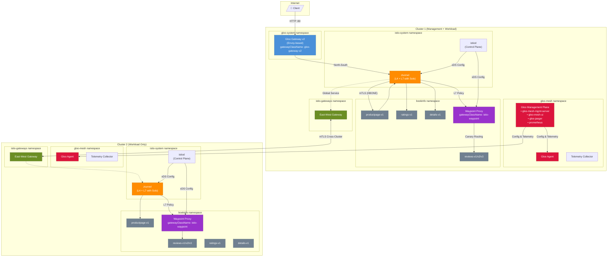

# Omni Demo Guide

## Architecture Overview



### Component Summary

| Component | Purpose |
|-----------|---------|
| **Gloo Gateway v2** | North-South ingress, API Gateway with enterprise auth and rate limiting |
| **Gloo Management Plane** | Unified UI, Insights, distributed tracing, metrics |
| **ztunnel** | Zero-trust L4 mTLS + L7 observability (Solo Enterprise) |
| **East-West Gateway** | Cross-cluster encrypted traffic |
| **Waypoint Proxy** | L7 policy enforcement: canary, auth, rate limiting |

---

## Workshop Setup

> **Working Directory:** All commands in this guide assume you are running from the `omni/` directory.

### Component Versions

| Component | Version |
|-----------|---------|
| Gateway API | v1.4.0 |
| Gloo Gateway | 2.0.1 |
| Istio (Solo distribution) | 1.28.1 |
| Gloo Platform | 2.11.0 |

### Step 1: Create Your Environment Configuration

Create an `env.sh` file with your cluster details and license keys:

```bash
cat > env.sh << 'EOF'
# Cluster kubectl contexts
export CLUSTER1=<your-cluster1-context>   # e.g., lutzl-cluster1
export CLUSTER2=<your-cluster2-context>   # e.g., lutzl-cluster2

# Component versions
export ISTIO_VERSION=1.28.1
export GLOO_VERSION=2.11.0

# License keys (obtain from Solo.io)
export GLOO_GATEWAY_LICENSE_KEY=<your-gateway-key>
export GLOO_MESH_LICENSE_KEY=<your-mesh-key>

# Solo istioctl path (will be set after installation)
export ISTIOCTL=/home/$USER/.istioctl/bin/istioctl
EOF
```

Then load the environment:

```bash
source env.sh
```

### Step 2: Run Automated Setup

The setup script installs all components on both clusters:
- Gateway API CRDs
- Gloo Gateway v2 (North-South ingress)
- Shared trust certificates for multi-cluster mTLS
- Istio Ambient Mesh (ztunnel + waypoint support)
- Gloo Platform Management Plane (UI, telemetry, Jaeger)
- Cluster 2 registration

Run the setup:

```bash
./scripts/setup.sh -c env.sh
```

**Setup takes approximately 10-15 minutes.** The script will:
1. Validate your environment configuration
2. Install all components in the correct order
3. Wait for deployments to be ready
4. Verify the installation
5. Display the Gloo Gateway IP address

> **Need GKE clusters?** Add `--create-clusters` flag and set `GKE_ZONE1`/`GKE_ZONE2` in your env.sh:
> ```bash
> ./scripts/setup.sh -c env.sh --create-clusters
> ```

### Step 3: Verify Setup Complete

After the script completes, verify all components are running:

```bash
./scripts/setup.sh -c env.sh --verify-only
```

This checks cluster registration, GatewayClasses, and pod status across both clusters (`gloo-system`, `gloo-mesh`, `istio-system`).

Expected output:
```
NAME       STATUS
cluster1   ACCEPTED
cluster2   ACCEPTED
```

```bash
# GatewayClasses available
kubectl --context ${CLUSTER1} get gatewayclasses
```

Expected output should include: `gloo-gateway-v2`, `istio`, `istio-waypoint`, `istio-eastwest`

### Step 4: Export Gateway IP

Set the Gloo Gateway IP for use during the demo:

```bash
export GLOO_IP=$(kubectl get svc -n gloo-system http --context $CLUSTER1 -o jsonpath="{.status.loadBalancer.ingress[0]['hostname','ip']}")
echo "Gloo Gateway IP: $GLOO_IP"
```

### Access the Management UI

```bash
kubectl --context ${CLUSTER1} port-forward -n gloo-mesh svc/gloo-mesh-ui 8090:8090 &
open http://localhost:8090
```

---

> **Prefer manual setup?** See the [Manual Setup Guide](setup.md) for step-by-step instructions with detailed explanations of each command. This is useful for learning, troubleshooting, or customizing the installation.

---

# Demo

> **Before starting:** Ensure environment variables are set:
> ```bash
> export GLOO_IP=$(kubectl get svc -n gloo-system http --context $CLUSTER1 -o jsonpath="{.status.loadBalancer.ingress[0]['hostname','ip']}")
> echo "Gloo Gateway IP: $GLOO_IP"
> ```

---

## Part 1: Onboarding an Application

### Why This Matters

**The Problem:** Traditional service mesh adoption requires injecting sidecar proxies into every pod. This means:
- Restarting all workloads during onboarding
- 0.5-1 vCPU overhead *per pod* (a "sidecar tax" that can cost $2M+ annually at scale)
- Complex upgrades requiring coordinated pod restarts
- Application teams blocked waiting for mesh configuration

**The Solution:** With Ambient Mesh, platform teams enable zero-trust networking for any namespace with a single label — **no sidecars, no restarts, no application changes**. Development teams get security and observability without any friction.

> 💡 **Business Impact:** Organizations report up to **92% infrastructure cost reduction** compared to sidecar-based mesh, plus dramatically faster onboarding — from weeks to minutes.

### Step 1: Deploy Bookinfo

We'll use Bookinfo as our sample application. These images include OpenTelemetry instrumentation for application-level tracing.

```bash
for context in ${CLUSTER1} ${CLUSTER2}; do
  kubectl --context ${context} create ns bookinfo
  kubectl --context ${context} apply -n bookinfo -f https://raw.githubusercontent.com/LutzLange/bookinfo/main/platform/kube/bookinfo-otel.yaml
done
```

Verify pods are running:
```bash
kubectl --context ${CLUSTER1} get pods -n bookinfo
```

### Step 2: Expose via Ingress

First, create a Static Backend to route through the Service VIP. This is critical because Gloo Gateway uses EDS (Endpoint Discovery Service) which would otherwise target pod IPs directly, bypassing the waypoint proxy:

```bash
kubectl --context=${CLUSTER1} apply -f - <<EOF
apiVersion: gateway.kgateway.dev/v1alpha1
kind: Backend
metadata:
  name: productpage-vip
  namespace: bookinfo
spec:
  type: Static
  static:
    hosts:
    - host: productpage.bookinfo.svc.cluster.local
      port: 9080
EOF
```

Now create the HTTPRoute referencing the Backend:

```bash
kubectl --context=${CLUSTER1} apply -f - <<EOF
apiVersion: gateway.networking.k8s.io/v1
kind: HTTPRoute
metadata:
  name: bookinfo-gg
  namespace: bookinfo
spec:
  parentRefs:
  - name: http
    namespace: gloo-system
  rules:
  - matches:
    - path:
        type: Exact
        value: /productpage
    - path:
        type: PathPrefix
        value: /static
    - path:
        type: Exact
        value: /login
    - path:
        type: Exact
        value: /logout
    backendRefs:
    - name: productpage-vip
      kind: Backend
      group: gateway.kgateway.dev
EOF
```

> **Why Static Backend?** Gloo Gateway normally uses EDS to discover pod IPs directly. Using a Static Backend forces traffic through the Service VIP, which then routes through ztunnel and waypoint proxies for proper L7 policy enforcement and tracing.

### Step 3: Verify Application (Not Yet in Mesh)

Test access:
```bash
open http://${GLOO_IP}/productpage
```

At this point, the application works but **is not in the mesh** — no mTLS, no observability. This is a security gap that traditional approaches take weeks to close.

### Step 4: Add to Mesh

```bash
# Add namespace to ambient mesh
kubectl --context ${CLUSTER1} label namespace bookinfo istio.io/dataplane-mode=ambient
kubectl --context ${CLUSTER2} label namespace bookinfo istio.io/dataplane-mode=ambient

# Configure namespace to use waypoint for L7 policies (needed for ingress traffic)
kubectl --context ${CLUSTER1} label namespace bookinfo istio.io/use-waypoint=waypoint
kubectl --context ${CLUSTER2} label namespace bookinfo istio.io/use-waypoint=waypoint
```

**That's it.** Wait a few seconds for ztunnel to pick up the workloads, then the application is part of the mesh with:
- ✅ **All traffic encrypted with mTLS** — zero-trust by default
- ✅ **Cryptographic identities (SPIFFE)** — no more IP-based security
- ✅ **L7 observability** — HTTP metrics without sidecars (Solo Enterprise exclusive)
- ✅ **No pod restarts** — zero disruption to running workloads

> 🎯 **Demo Talking Point:** "Notice that the pods are still running with the same restart count. We just enabled encryption and observability for the entire namespace without touching the application. Platform teams can roll this out progressively, namespace by namespace, with zero coordination required from dev teams."

Verify ztunnel is handling traffic:
```bash
kubectl --context ${CLUSTER1} logs -n istio-system -l app=ztunnel --tail=5 | grep bookinfo
```

---

## Part 2: Zero-Trust Security

### Why This Matters

**The Problem:** Organizations struggle to implement zero-trust security across Kubernetes:
- Network policies only work at L3/L4 — they can't verify *who* is making a request
- Traditional firewalls require ticket-based workflows that slow development velocity
- Cross-cluster communication is often unencrypted or uses brittle certificate management
- Security teams lack visibility into east-west traffic

**The Solution:** Ambient Mesh provides **automatic mTLS everywhere** — every service gets a cryptographic identity (SPIFFE), and all traffic is encrypted without any per-service configuration. Cross-cluster communication flows through encrypted east-west gateways with the same strong identity guarantees.

> 💡 **Business Impact:** Meet compliance requirements (PCI-DSS, HIPAA, SOC2) for encryption-in-transit automatically. Security teams get L7 visibility into all service-to-service communication without application changes.

### Step 5: Verify Mesh Enrollment

In ambient mode, ztunnel handles all mTLS — workload pods don't have certificate files mounted. Verify traffic is encrypted by checking ztunnel logs for HBONE connections:

```bash
# Generate some traffic first
curl -s http://${GLOO_IP}/productpage > /dev/null

# Check ztunnel logs for encrypted traffic (HBONE protocol)
kubectl --context ${CLUSTER1} logs -n istio-system -l app=ztunnel --tail=50 | grep -E "inbound|outbound|HBONE"
```

You should see log entries showing traffic being handled by ztunnel with source and destination identities.

### Step 6: Peer Clusters

Enable cross-cluster communication with encrypted east-west gateways:

```bash
# Deploy east-west gateways
$ISTIOCTL --context=${CLUSTER1} multicluster expose -n istio-gateways
$ISTIOCTL --context=${CLUSTER2} multicluster expose -n istio-gateways

# Wait for LoadBalancer IPs (may take 1-2 minutes on cloud providers)
kubectl --context ${CLUSTER1} get svc -n istio-gateways istio-eastwest
kubectl --context ${CLUSTER2} get svc -n istio-gateways istio-eastwest

# Link clusters (only after both IPs are assigned - check EXTERNAL-IP is not <pending>)
$ISTIOCTL multicluster link --contexts=$CLUSTER1,$CLUSTER2 -n istio-gateways

# Verify linking was successful
kubectl --context ${CLUSTER1} get gateways -n istio-gateways
# Expected: istio-eastwest AND istio-remote-peer-cluster2 both with PROGRAMMED=True
```

**Result:** Services can now discover and communicate across clusters — all mTLS-encrypted, no VPNs or complex network setup required.

### Step 7: Add Gloo Gateway to Mesh

```bash
kubectl --context ${CLUSTER1} label namespace gloo-system istio.io/dataplane-mode=ambient
```

Now ingress traffic is mTLS-encrypted end-to-end from client to service.

---

## Part 3: Observability

### Why This Matters

Platform teams managing multiple clusters need unified visibility — not fragmented tools per cluster. Gloo Platform provides a **single pane of glass** with security insights, real-time metrics across all clusters, and optional distributed tracing.

> 💡 **Solo Enterprise Advantage:** Get L7 observability (HTTP methods, paths, status codes) from ztunnel *without* deploying waypoint proxies. Open source Istio only provides L4 metrics at this layer.

### Step 8: Verify Observability

```bash
kubectl --context ${CLUSTER1} port-forward -n gloo-mesh svc/gloo-mesh-ui 8090:8090
open http://localhost:8090
```

### Dashboard Overview

The UI shows:
- **Clusters:** Both clusters registered and healthy
- **Services:** All mesh services with health status
- **Insights:** Automatic security and configuration recommendations

### Distributed Tracing (Optional)

> **Note:** Full distributed tracing requires additional configuration. See [Step 14: Enable Tracing](#step-14-enable-tracing-optional) at the end of this guide.

Once tracing is configured, navigate to **Tracing** in the sidebar to view request flows across services.

**Solo Enterprise Advantage:** With Solo's ztunnel, you see L7 details (HTTP method, path, status codes) without deploying waypoint proxies. Community Istio ztunnel only provides L4 metrics.

### Insights Engine

Navigate to **Insights** to see automatic recommendations:
- Security vulnerabilities
- Configuration issues
- Best practice violations

---

## Part 4: Global Services

### Why This Matters

Running services across multiple clusters is table stakes for resilience, but traditional approaches require complex DNS configuration, manual failover procedures, or expensive global load balancers. With Gloo Platform, a single label makes any service **globally addressable** with automatic failover — no infrastructure changes required.

> 💡 **Business Impact:** Achieve multi-region high availability without managing separate DNS entries or load balancer configurations per service.

### Step 9: Enable Global Services

Make productpage available as a global service across both clusters:

```bash
for context in ${CLUSTER1} ${CLUSTER2}; do
  kubectl --context ${context} -n bookinfo label service productpage solo.io/service-scope=global
  kubectl --context ${context} -n bookinfo annotate service productpage networking.istio.io/traffic-distribution=Any
done
```

Update the Static Backend to use the global mesh hostname:

```bash
kubectl --context=${CLUSTER1} apply -f - <<EOF
apiVersion: gateway.kgateway.dev/v1alpha1
kind: Backend
metadata:
  name: productpage-vip
  namespace: bookinfo
spec:
  type: Static
  static:
    hosts:
    - host: productpage.bookinfo.mesh.internal
      port: 9080
EOF
```

The HTTPRoute continues to use the same Backend reference — no changes needed there.

### Step 10: Test Failover

```bash
open http://${GLOO_IP}/productpage
```

Refresh multiple times — notice the **reviews pod name changes** between clusters.

Identify which cluster served each request:
```bash
for ctx in ${CLUSTER1} ${CLUSTER2}; do
  echo "=== $ctx ==="
  kubectl --context $ctx get pods -n bookinfo -l 'app in (productpage,reviews)' -o wide
done
```

**Simulate Failover:** Scale down productpage on cluster1:
```bash
kubectl --context ${CLUSTER1} scale deploy productpage-v1 -n bookinfo --replicas=0
```

Wait ~30 seconds for the mesh to propagate the endpoint changes across clusters via the east-west gateway. Then traffic automatically routes to cluster2 — no configuration changes needed.

> **Note:** The mesh needs time to detect the pod termination and update routing across clusters. If you test immediately after scale-down, you may see transient 503 errors.

Restore:
```bash
kubectl --context ${CLUSTER1} scale deploy productpage-v1 -n bookinfo --replicas=1
```

---

## Part 5: Canary & Rate Limiting

### Why This Matters

Traditional API gateways were designed before Kubernetes — they require external databases, proprietary configuration, and don't integrate with service mesh. Gloo Gateway is **cloud-native from the ground up**: built on Envoy, Kubernetes Gateway API-native, and seamlessly integrated with the mesh for unified north-south and east-west traffic management.

> 💡 **One API, Full Stack:** The same HTTPRoute and policy resources work across ingress and mesh. Platform teams define guardrails once; dev teams get self-service canary deployments and traffic control.

### Step 11: Deploy Waypoint

Waypoints enable advanced L7 traffic management for specific services:

```bash
for ctx in ${CLUSTER1} ${CLUSTER2}; do
kubectl --context ${ctx} apply -f - <<EOF
apiVersion: gateway.networking.k8s.io/v1
kind: Gateway
metadata:
  name: waypoint
  namespace: bookinfo
spec:
  gatewayClassName: istio-waypoint
  listeners:
  - name: mesh
    port: 15008
    protocol: HBONE
EOF
done
```

Attach waypoint to the reviews service:
```bash
kubectl --context ${CLUSTER1} label svc reviews -n bookinfo istio.io/use-waypoint=waypoint
kubectl --context ${CLUSTER2} label svc reviews -n bookinfo istio.io/use-waypoint=waypoint
```

Wait ~10 seconds for the routing rules to propagate before testing.

#### Enable Tracing on Waypoints (Optional)

To see detailed traces through the waypoint proxy in Jaeger, see [Step 14: Enable Tracing](#step-14-enable-tracing-optional) at the end of this guide.

### Step 12: Canary Routing

Route user "jason" to reviews-v2 (with stars), everyone else to reviews-v1 (no stars):

```bash
for ctx in ${CLUSTER1} ${CLUSTER2}; do
kubectl --context ${ctx} apply -f - <<EOF
apiVersion: gateway.networking.k8s.io/v1
kind: HTTPRoute
metadata:
  name: reviews
  namespace: bookinfo
spec:
  parentRefs:
  - group: ""
    kind: Service
    name: reviews
    port: 9080
  rules:
  - matches:
    - headers:
      - name: end-user
        value: jason
    backendRefs:
    - name: reviews-v2
      port: 9080
  - backendRefs:
    - name: reviews-v1
      port: 9080
EOF
done
```

Wait ~10 seconds for the routing rules to propagate.

**Test Canary Routing:**

1. Open `http://${GLOO_IP}/productpage`
2. **Without login:** No stars (reviews-v1)
3. **Login as "jason":** Black stars (reviews-v2)
4. **Login as anyone else:** No stars (reviews-v1)

Or test via CLI (using ratings pod which has curl installed):
```bash
# Default - reviews-v1 (no ratings/stars in response)
kubectl --context ${CLUSTER1} exec -n bookinfo deploy/ratings-v1 -- \
  curl -s reviews:9080/reviews/0

# User jason - reviews-v2 (black stars, "color": "black" in response)
kubectl --context ${CLUSTER1} exec -n bookinfo deploy/ratings-v1 -- \
  curl -s -H "end-user: jason" reviews:9080/reviews/0
```

Expected responses:
- **reviews-v1**: No `"color"` field in the ratings section (no stars displayed)
- **reviews-v2**: Contains `"color": "black"` (black stars displayed)

### Step 13: Rate Limiting

Apply a rate limit to productpage (5 requests/minute):

```bash
kubectl --context ${CLUSTER1} apply -f - <<EOF
apiVersion: gloo.solo.io/v1alpha1
kind: GlooTrafficPolicy
metadata:
  name: productpage-ratelimit
  namespace: bookinfo
spec:
  targetRefs:
  - group: gateway.networking.k8s.io
    kind: HTTPRoute
    name: bookinfo-gg
  rateLimit:
    local:
      tokenBucket:
        maxTokens: 5
        tokensPerFill: 5
        fillInterval: 60s
EOF
```

**Test Rate Limiting:**

```bash
for i in {1..10}; do 
  echo "Request $i: $(curl -s -o /dev/null -w "%{http_code}" http://${GLOO_IP}/productpage)"
  sleep 0.5
done
```

Expected: First 5 return `200`, remaining return `429 Too Many Requests`.

> **Note:** Gloo Gateway's local tokenBucket rate limiting returns `429 Too Many Requests` status when the limit is exceeded. This is the primary indicator of rate limiting being enforced.

> 🎯 **Demo Talking Point:** "We just added API protection with a simple Kubernetes resource — no separate rate limiting service, no external database. This same policy model works for OAuth, JWT validation, WAF, and more. Platform teams define the guardrails; dev teams get self-service within those boundaries."

**Clean Up Rate Limit:**

```bash
kubectl --context ${CLUSTER1} delete glootrafficpolicy productpage-ratelimit -n bookinfo
```

---

## Step 14: Enable Tracing (Optional)

This step configures end-to-end distributed tracing across all components:
- **ztunnel** (L4/L7 proxy - Solo Enterprise feature)
- **Gloo Gateway** (ingress)
- **Waypoint proxies** (L7 policy enforcement)
- **Application services** (via OpenTelemetry instrumentation)

> **Prerequisites:** Complete the main workshop steps first. Tracing requires the telemetry collector and Jaeger to be running (installed during setup).

### Step 0: Configure ztunnel Distributed Tracing

Solo's Enterprise ztunnel includes L7 tracing capabilities. The default configuration points to the wrong collector endpoint. Update it to point to the Gloo telemetry collector:

```bash
# Check current ztunnel tracing config
kubectl --context ${CLUSTER1} get configmap istio-ztunnel -n istio-system -o jsonpath='{.data.l7_config\.yaml}'

# Update to point to correct collector
for ctx in ${CLUSTER1} ${CLUSTER2}; do
kubectl --context ${ctx} patch configmap istio-ztunnel -n istio-system --type merge -p '{
  "data": {
    "l7_config.yaml": "accessLog:\n  enabled: true\n  skipConnectionLog: false\ndistributedTracing:\n  enabled: true\n  otlpEndpoint: http://gloo-telemetry-collector.gloo-mesh:4317\nenabled: true\nmetrics:\n  enabled: true\n"
  }
}'
done

# Restart ztunnel to apply changes
for ctx in ${CLUSTER1} ${CLUSTER2}; do
  kubectl --context ${ctx} rollout restart daemonset/ztunnel -n istio-system
  kubectl --context ${ctx} rollout status daemonset/ztunnel -n istio-system --timeout=120s
done
```

> **Note:** ztunnel cannot initiate traces - it reports traces when requests already have trace context from ingress gateways or waypoint proxies.

### Step 1: Create ClusterIP Service for Telemetry Collector

> **Important**: The default `gloo-telemetry-collector` service is a headless service (`ClusterIP: None`). In ambient mode, waypoints use ORIGINAL_DST cluster types which cannot export traces to headless services. Creating a ClusterIP service resolves this.

```bash
# Create ClusterIP service for telemetry collector
for ctx in ${CLUSTER1} ${CLUSTER2}; do
kubectl --context ${ctx} apply -f - <<EOF
apiVersion: v1
kind: Service
metadata:
  name: gloo-telemetry-collector-clusterip
  namespace: gloo-mesh
  labels:
    app: gloo-telemetry-collector-agent
spec:
  type: ClusterIP
  selector:
    app.kubernetes.io/instance: gloo-platform
    app.kubernetes.io/name: telemetryCollector
    component: agent-collector
  ports:
  - name: grpc-otlp
    port: 4317
    targetPort: 4317
    protocol: TCP
    appProtocol: grpc
  - name: otlp-http
    port: 4318
    targetPort: 4318
    protocol: TCP
  - name: zipkin
    port: 9411
    targetPort: 9411
    protocol: TCP
  - name: grpc-jaeger
    port: 14250
    targetPort: 14250
    protocol: TCP
    appProtocol: grpc
EOF
done
```

> **Note**: The `appProtocol: grpc` annotation is critical - it tells Istio to use HTTP/2 for these ports, which is required for gRPC trace export.

### Step 2: Add Extension Provider to Mesh Config

The Istio mesh config needs an `extensionProvider` to define how to reach the OpenTelemetry collector. We point to the **ClusterIP** service (not the headless service). **Both clusters** need this configuration for waypoint tracing to work:

```bash
# Check if extensionProvider already exists on both clusters
for ctx in ${CLUSTER1} ${CLUSTER2}; do
  echo "=== $ctx ==="
  kubectl --context ${ctx} get configmap istio -n istio-system -o jsonpath='{.data.mesh}' | grep -A5 extensionProviders
done
```

If the output is empty, add the extension provider by patching the configmap on **both clusters**:

```bash
for ctx in ${CLUSTER1} ${CLUSTER2}; do
  echo "Configuring extensionProvider on $ctx..."

  # Get current mesh config
  CURRENT_MESH=$(kubectl --context ${ctx} get configmap istio -n istio-system -o jsonpath='{.data.mesh}')

  # Skip if already configured with ClusterIP service
  if echo "$CURRENT_MESH" | grep -q "gloo-telemetry-collector-clusterip"; then
    echo "  $ctx: Already configured"
    continue
  fi

  # Add extensionProviders - using ClusterIP service for waypoint compatibility
  NEW_MESH="${CURRENT_MESH}
extensionProviders:
- name: otel-tracing
  opentelemetry:
    service: gloo-telemetry-collector-clusterip.gloo-mesh.svc.cluster.local
    port: 4317"

  # Apply the patch
  kubectl --context ${ctx} patch configmap istio -n istio-system \
    --type merge -p "{\"data\":{\"mesh\":$(echo "$NEW_MESH" | jq -Rs .)}}"
done

# Restart istiod on both clusters to pick up the change
for ctx in ${CLUSTER1} ${CLUSTER2}; do
  kubectl --context ${ctx} rollout restart deployment/istiod -n istio-system
done
for ctx in ${CLUSTER1} ${CLUSTER2}; do
  kubectl --context ${ctx} rollout status deployment/istiod -n istio-system --timeout=120s
done
```

### Step 3: Configure Gloo Gateway Tracing

Gloo Gateway v2 is a standalone Envoy proxy (not Istio-managed), so it requires its own tracing configuration via `HTTPListenerPolicy`:

```bash
# ReferenceGrant to allow cross-namespace access to telemetry collector
kubectl --context ${CLUSTER1} apply -f - <<EOF
apiVersion: gateway.networking.k8s.io/v1beta1
kind: ReferenceGrant
metadata:
  name: allow-otel-collector-traces-access
  namespace: gloo-mesh
spec:
  from:
  - group: gateway.kgateway.dev
    kind: HTTPListenerPolicy
    namespace: gloo-system
  to:
  - group: ""
    kind: Service
    name: gloo-telemetry-collector
EOF

# HTTPListenerPolicy to configure tracing on Gloo Gateway
kubectl --context ${CLUSTER1} apply -f - <<EOF
apiVersion: gateway.kgateway.dev/v1alpha1
kind: HTTPListenerPolicy
metadata:
  name: tracing-policy
  namespace: gloo-system
spec:
  targetRefs:
  - group: gateway.networking.k8s.io
    kind: Gateway
    name: http
  tracing:
    provider:
      openTelemetry:
        serviceName: gloo-gateway
        grpcService:
          backendRef:
            name: gloo-telemetry-collector
            namespace: gloo-mesh
            port: 4317
    spawnUpstreamSpan: true
EOF
```

Verify the policy is attached:
```bash
kubectl --context ${CLUSTER1} get httplistenerpolicy -n gloo-system
# Should show ACCEPTED: True
```

### Step 4: Configure Mesh and Waypoint Tracing

Enable tracing for both the mesh (ztunnel) and waypoint proxies:

**4a. Mesh-wide Telemetry** (enables ztunnel tracing):
```bash
for ctx in ${CLUSTER1} ${CLUSTER2}; do
kubectl --context ${ctx} apply -f - <<EOF
apiVersion: telemetry.istio.io/v1
kind: Telemetry
metadata:
  name: mesh-tracing
  namespace: istio-system
spec:
  tracing:
  - providers:
    - name: otel-tracing
    randomSamplingPercentage: 100
EOF
done
```

**4b. Waypoint Telemetry** (enables L7 traces through waypoint proxies):
```bash
for ctx in ${CLUSTER1} ${CLUSTER2}; do
kubectl --context ${ctx} apply -f - <<EOF
apiVersion: telemetry.istio.io/v1
kind: Telemetry
metadata:
  name: tracing-waypoint
  namespace: bookinfo
spec:
  targetRefs:
  - kind: Gateway
    name: waypoint
    group: gateway.networking.k8s.io
  tracing:
  - providers:
    - name: otel-tracing
    randomSamplingPercentage: 100
EOF
done
```

If you modified the mesh config in Step 2, restart the waypoints on **both clusters** to pick up the new extension provider:
```bash
for ctx in ${CLUSTER1} ${CLUSTER2}; do
  kubectl --context ${ctx} rollout restart deployment/waypoint -n bookinfo
done
for ctx in ${CLUSTER1} ${CLUSTER2}; do
  kubectl --context ${ctx} rollout status deployment/waypoint -n bookinfo --timeout=120s
done
```

### Step 5: Generate Traffic and View Traces

Generate some traffic:
```bash
for i in {1..10}; do
  curl -s http://${GLOO_IP}/productpage > /dev/null
  sleep 1
done
```

Access Jaeger in the Gloo UI:
```bash
kubectl --context ${CLUSTER1} port-forward -n gloo-mesh svc/gloo-mesh-ui 8090:8090
open http://localhost:8090
```

Navigate to **Tracing** in the sidebar:
1. Select service `gloo-gateway` to see ingress traces
2. Select service `productpage.bookinfo` for application traces
3. Select service `waypoint.bookinfo` for L7 policy traces
4. Click **Find Traces**
5. Click on a trace to see the full request flow

### Trace Flow Diagram

```
Client → Gloo Gateway → ztunnel → waypoint → productpage → reviews/details/ratings
         (trace start)             (L7 trace)  (app traces via OTel instrumentation)
```

Expected services in traces:
- `gloo-gateway` - Ingress entry point (HTTPListenerPolicy)
- `ztunnel` - L4/L7 mesh proxy (Solo Enterprise feature)
- `waypoint.bookinfo` or destination FQDNs (e.g., `details.bookinfo.svc.cluster.local`) - L7 waypoint traces
- `productpage`, `details`, `ratings` - OTel-instrumented Bookinfo services

Services that may not appear:
- `reviews` - Not OTel-instrumented in current Bookinfo images

> **Note:** The Bookinfo images for productpage, details, and ratings include OpenTelemetry instrumentation. The reviews service (Java-based) requires manual instrumentation.

---

## Summary

| Capability | How | Business Value |
|------------|-----|----------------|
| **Onboard to Mesh** | One namespace label | **92% cost reduction** vs sidecars, zero dev team friction |
| **mTLS Everywhere** | Automatic with ambient | Compliance (PCI-DSS, HIPAA, SOC2) out of the box |
| **Multi-Cluster** | Global service labels | HA/DR without complex DNS or load balancer config |
| **Observability** | Gloo UI + Jaeger | **10x faster MTTR** with unified visibility |
| **Canary Routing** | HTTPRoute + Waypoint | Safe deployments, self-service for dev teams |
| **Rate Limiting** | GlooTrafficPolicy | API protection without separate gateway infrastructure |

### Key Takeaways for Platform Teams

1. **Unified Platform:** API Gateway + Service Mesh + Multi-Cluster — one control plane, one configuration model
2. **Kubernetes-Native:** Gateway API is the standard; no proprietary lock-in, portable across clouds
3. **Progressive Adoption:** Start with ingress, add mesh per-namespace, scale to multi-cluster — at your own pace
4. **Enterprise Support:** Solo.io is the #1 corporate contributor to Istio, with 24/7 support and FIPS-validated images
